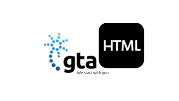

### About me
Hi! My name is Anton Lacson, I was born and raised on the Island of Guam and moved to Minnesota to pursue my bachelors degree at the University of St. Thomas. 
I am on my last semester of college and getting ready to graduate with a major in Computer Science with double minors in Business Analytics and Data Science. 
Throughout my time in college, I have developed and improved my critical thinking and technical skills. Computer Science is a versatile major with many things you 
get into after college. Throughout my time in college, I realized that my interest in computer science lies in the realm of data analysis and problem solving. 
Where I can assess data and give feedback that optimizes improvmements, which leads to better results and better performance within a business. Additionally, with my background in 
computer science, I will always have the technical skills I have developed throughout college to my advantage. 

### Skills 
Languages: Python, C, Java, R Programming, SQL, HTML, Javascript 

Software: Alteryx, ObservePoint, Adobe Data Collection, Adobe Analytics, Adobe Target 

Computer: Microsoft Office: Word, Excel, PowerPoint, PowerBI, Access 

### Projects 
GTA, Teleguam Holdings LLC - Information Technology Summer Intern 
- During my summer intnernship with GTA's information technology team back in 2022, I assisted in updating the company's Employee Portal using HTML and Javascript by implementing a generate verification of employment feature, which lead to enhancing user experience and functionality.
- Task: Helped assist in integrating the HTML code that implemented to front end form interface. 

EZDocs - Senior Capstone Project
- A web documentaion editor to make it faster and easier for entry-level IT and software workers to create technical documentation files like QA test plans, incident report, API docs, etc.
- With core features such as a rich text editor with an embedded AI assistant inside the search bar to help guide users for writing and improving documentation.
- Very user friendly and meant for people who need to do documentation in their job with no prior experience needed with technical documentation standards since EZDocs helps guide users.
- Task: Implemented a full stack user authentication system that allows users to register and log with a username and password.
- Task: Implemented a full stack saved document feature where users can save documents to their EZDocs account.

### Click link to view my resume!
[View my Resume (PDF)](https://raw.githubusercontent.com/Anton-Lacson/Anton_Lacson_Portfolio/main/Antonio_Lacson_Resume_2024-2025.pdf
)
